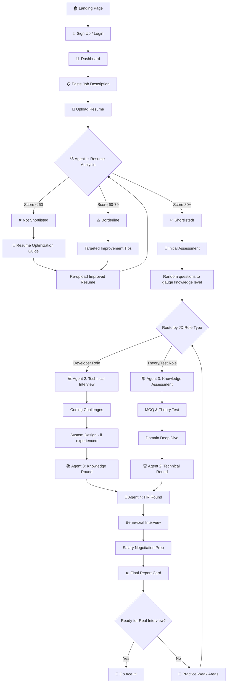
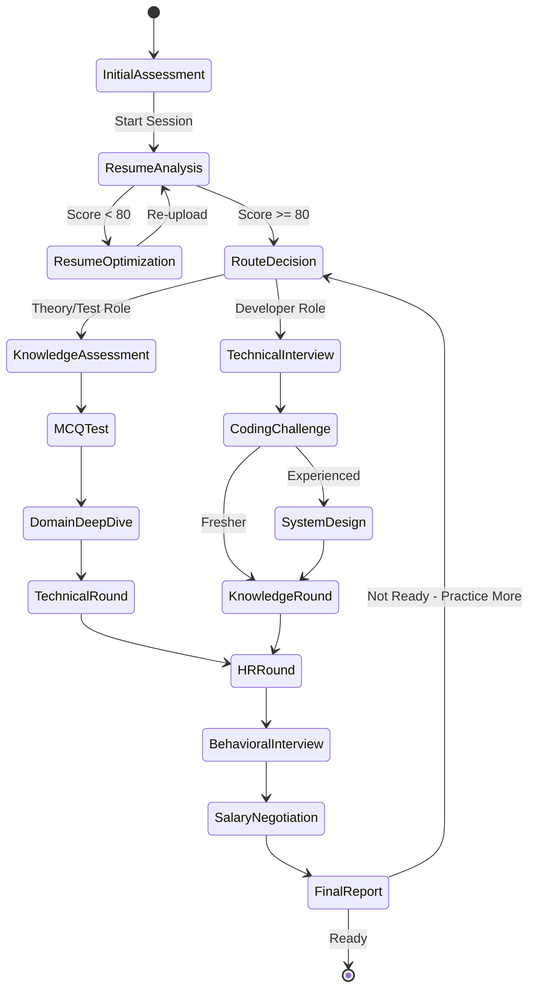

# InterviewPilot — Multi-Agentic Mock Interview Automation Platform

A fully AI-powered portal that simulates the **end-to-end hiring process** — from resume screening to final HR rounds — using 4 specialized AI agents with 8 sub-agents, guiding candidates until they're ready to crack their target job.

---

## User Review Required

> [!IMPORTANT]
> **Project Name**: I've named it **InterviewPilot**. Let me know if you'd prefer a different name.

> [!IMPORTANT]
> **AI Provider Choice**: The plan uses **Google Gemini 2.0 Flash** (free tier: ~15 RPM, ~1000 RPD) as the primary LLM and **Groq** (free tier: ~30 RPM, Llama models) as fallback. Both are completely free. Do you have API keys for either/both?

> [!WARNING]
> **Scope**: This is a **large-scale project** (~40+ files, 15+ pages). I recommend building in **3 phases** (MVP → Enhanced → Polish). The MVP alone will take significant effort. Are you okay with this phased approach?

> [!IMPORTANT]
> **Supabase vs Self-hosted**: The plan uses **Supabase** (free tier) for database + auth + file storage — all in one. This saves massive development time. Do you have a Supabase account or prefer a different setup?

---

## System Architecture Overview

```mermaid
graph TB
    subgraph "Frontend - Next.js"
        LP[Landing Page]
        AUTH[Auth Pages]
        DASH[Dashboard]
        JD[Job Description Input]
        RU[Resume Upload]
        RS[Resume Screening Panel]
        TI[Technical Interview Room]
        KA[Knowledge Assessment Room]
        HR[HR Interview Room]
        PROG[Progress Tracker]
        REPORT[Final Report]
    end

    subgraph "Backend - Node.js/Express"
        API[REST API Layer]
        WS[WebSocket Server]
        ORCH[Agent Orchestrator - LangGraph.js]
        
        subgraph "Agent System"
            AG1[🔍 Agent 1: Resume Analyst]
            AG1a[Sub: Resume Parser]
            AG1b[Sub: Resume Optimizer]
            
            AG2[💻 Agent 2: Technical Interviewer]
            AG2a[Sub: Coding Challenge Agent]
            AG2b[Sub: System Design Agent]
            
            AG3[📚 Agent 3: Knowledge Assessor]
            AG3a[Sub: MCQ Generator]
            AG3b[Sub: Domain Expert Agent]
            
            AG4[🤝 Agent 4: HR/Behavioral Coach]
            AG4a[Sub: Behavioral Q&A Agent]
            AG4b[Sub: Salary/Negotiation Agent]
        end
    end

    subgraph "Data Layer"
        SB[(Supabase PostgreSQL)]
        STORE[Supabase Storage - Resumes]
        SBAUTH[Supabase Auth]
    end

    subgraph "AI Providers - FREE"
        GEMINI[Google Gemini 2.0 Flash]
        GROQ[Groq API - Llama 3.3]
    end

    LP --> AUTH --> DASH
    DASH --> JD --> RU --> RS
    RS --> TI --> KA --> HR --> REPORT
    API --> ORCH
    WS --> ORCH
    ORCH --> AG1 & AG2 & AG3 & AG4
    AG1 --> AG1a & AG1b
    AG2 --> AG2a & AG2b
    AG3 --> AG3a & AG3b
    AG4 --> AG4a & AG4b
    ORCH --> GEMINI & GROQ
    API --> SB & STORE & SBAUTH
```



---

## Complete Tech Stack (All Free Tools)

### Frontend
| Technology | Purpose | Cost |
|:---|:---|:---|
| **Next.js 14** (App Router) | React framework with SSR, routing, API routes | Free |
| **TypeScript** | Type safety | Free |
| **Vanilla CSS** (with CSS Modules) | Styling with modern design system | Free |
| **Socket.io Client** | Real-time interview chat | Free |
| **React Markdown** | Render AI responses | Free |
| **Monaco Editor** | In-browser code editor for coding challenges | Free |
| **Framer Motion** | Animations & transitions | Free |
| **React Hook Form + Zod** | Form validation | Free |
| **Lucide React** | Icon library | Free |

### Backend
| Technology | Purpose | Cost |
|:---|:---|:---|
| **Node.js + Express** | REST API server | Free |
| **TypeScript** | Type safety | Free |
| **LangGraph.js** | Multi-agent orchestration framework | Free (MIT) |
| **LangChain.js** | LLM abstraction, prompts, chains | Free (MIT) |
| **Socket.io** | Real-time bidirectional communication | Free |
| **pdf-parse** | Extract text from PDF resumes | Free |
| **mammoth** | Extract text from DOCX resumes | Free |
| **multer** | File upload handling | Free |
| **jsonwebtoken + bcrypt** | JWT auth (backup to Supabase) | Free |
| **zod** | Runtime validation | Free |

### Database & Storage
| Technology | Purpose | Cost |
|:---|:---|:---|
| **Supabase PostgreSQL** | Primary database (500MB free) | Free |
| **Supabase Auth** | User authentication (50K MAU) | Free |
| **Supabase Storage** | Resume file storage (1GB free) | Free |

### AI / LLM (Primary + Fallback)
| Provider | Model | Free Limits | Use Case |
|:---|:---|:---|:---|
| **Google Gemini** | gemini-2.0-flash | ~15 RPM, ~1000 RPD | Primary LLM for all agents |
| **Groq** | llama-3.3-70b | ~30 RPM, ~1000 RPD | Fallback + rapid-fire Q&A |

### Deployment
| Service | Purpose | Cost |
|:---|:---|:---|
| **Vercel** | Frontend hosting (Next.js) | Free (Hobby) |
| **Render** | Backend hosting (Express server) | Free (with sleep) |
| **Supabase** | Database + Auth + Storage | Free |

### Testing
| Tool | Purpose | Cost |
|:---|:---|:---|
| **Vitest** | Unit & integration tests | Free |
| **Playwright** | E2E browser tests | Free |
| **Supertest** | API endpoint tests | Free |

---

## Detailed Agent Architecture

### 🔍 Agent 1: Resume Analyst (The Gatekeeper)

**Purpose**: Analyzes resumes against job descriptions, determines shortlisting probability, and provides actionable improvement guidance.

#### Sub-Agent 1A: Resume Parser
- **Input**: PDF/DOCX file
- **Process**: 
  - Extracts raw text using `pdf-parse` / `mammoth`
  - Sends to LLM to structure into JSON: `{ name, email, phone, skills[], experience[], education[], projects[], certifications[] }`
  - Calculates metadata: total YOE, skill categories, keyword density
- **Output**: Structured resume JSON

#### Sub-Agent 1B: Resume Optimizer
- **Input**: Structured resume + Job Description
- **Process**:
  - Keyword gap analysis (JD keywords vs Resume keywords)
  - ATS compatibility scoring (format, structure, keyword placement)
  - Experience alignment scoring
  - Skills match percentage
  - Generates specific, actionable suggestions:
    - "Add X keyword in your experience section"
    - "Quantify achievement Y with metrics"
    - "Reorder skills to prioritize Z"
- **Output**: `{ matchScore: 0-100, atsScore: 0-100, gaps[], suggestions[], updatedResumeText }`

#### Resume Shortlisting Decision Matrix
```
Score 80-100: ✅ Shortlisted → Move to Interview Pipeline
Score 60-79:  ⚠️ Borderline → Show specific improvements needed
Score 0-59:   ❌ Not Shortlisted → Full resume revamp guidance
```

---

### 💻 Agent 2: Technical Interviewer (The Expert)

**Purpose**: Conducts realistic technical interviews based on the job role, adapting difficulty based on experience level (fresher vs experienced).

#### Sub-Agent 2A: Coding Challenge Agent
- **Dynamic difficulty**: Adjusts based on JD requirements + candidate level
- **Features**:
  - Generates coding problems relevant to the JD tech stack
  - Provides hints system (3 levels: subtle → moderate → detailed)
  - Evaluates code solutions for:
    - Correctness
    - Time/Space complexity
    - Code quality & readability
    - Edge case handling
  - Uses Monaco Editor in-browser for live coding
  - Supports multiple languages (Python, JavaScript, Java, C++)

#### Sub-Agent 2B: System Design Agent
- **For experienced candidates (1+ years)**:
  - Generates system design questions relevant to the role
  - Guides through: Requirements → High-Level Design → Deep Dive → Trade-offs
  - Evaluates: Scalability, Availability, Consistency, Performance awareness
- **For freshers**:
  - Simplified "design a feature" style questions
  - Focus on basic architecture concepts

**Interview Flow**:
```
1. Warm-up question (easy) → Gauge baseline
2. Core problem (medium) → Test fundamentals
3. Follow-up (hard) → Test depth
4. System Design (if applicable) → Test breadth
```

---

### 📚 Agent 3: Knowledge Assessor (The Examiner)

**Purpose**: Tests theoretical knowledge, domain expertise, and conceptual understanding through diverse question formats.

#### Sub-Agent 3A: MCQ & Theory Generator
- **Generates questions based on**:
  - JD-specific technologies
  - Computer Science fundamentals (if applicable)
  - Role-specific domain knowledge
- **Question types**:
  - Multiple Choice (4 options)
  - True/False with explanation
  - Short answer
  - "Explain the difference between X and Y"
  - "What happens when...?" scenarios
- **Adaptive difficulty**: Increases/decreases based on performance

#### Sub-Agent 3B: Domain Expert Agent
- **Deep-dive conversations**:
  - "Tell me about your project X" → follows up with probing questions
  - Technology-specific deep dives
  - Architecture decision discussions
  - Debugging scenario simulations
- **Evaluation criteria**: Depth, accuracy, practical understanding, communication clarity

---

### 🤝 Agent 4: HR/Behavioral Coach (The Mentor)

**Purpose**: Prepares candidates for HR rounds, behavioral interviews, and salary negotiation.

#### Sub-Agent 4A: Behavioral Q&A Agent
- **STAR Method Training**:
  - Situation → Task → Action → Result
  - Provides templates and examples
- **Common behavioral questions**:
  - "Tell me about yourself" (customized pitch creator)
  - Conflict resolution scenarios
  - Leadership & teamwork examples
  - Failure & learning stories
  - "Why this company?" (researches company based on JD)
- **Mock conversation**: Simulates real HR interviewer personality

#### Sub-Agent 4B: Salary & Negotiation Agent
- **Provides guidance on**:
  - Market salary ranges (based on role/experience/location from JD)
  - Negotiation tactics
  - Counter-offer strategies
  - Benefits evaluation
  - "What are your salary expectations?" answer formulation

---

## Complete User Flow



---

## Project Structure

```
interview-pilot/
├── frontend/                          # Next.js 14 App
│   ├── public/
│   │   ├── fonts/
│   │   └── images/
│   ├── src/
│   │   ├── app/
│   │   │   ├── layout.tsx             # Root layout with providers
│   │   │   ├── page.tsx               # Landing page
│   │   │   ├── globals.css            # Global design system
│   │   │   ├── (auth)/
│   │   │   │   ├── login/page.tsx
│   │   │   │   └── signup/page.tsx
│   │   │   ├── dashboard/
│   │   │   │   └── page.tsx           # User dashboard
│   │   │   ├── session/
│   │   │   │   ├── new/page.tsx       # New interview session (JD + Resume)
│   │   │   │   └── [id]/
│   │   │   │       ├── page.tsx       # Session overview
│   │   │   │       ├── resume/page.tsx      # Resume analysis view
│   │   │   │       ├── technical/page.tsx   # Technical interview room
│   │   │   │       ├── knowledge/page.tsx   # Knowledge assessment room
│   │   │   │       ├── hr/page.tsx          # HR interview room
│   │   │   │       └── report/page.tsx      # Final report
│   │   │   └── profile/
│   │   │       └── page.tsx
│   │   ├── components/
│   │   │   ├── ui/                    # Reusable UI components
│   │   │   │   ├── Button.tsx
│   │   │   │   ├── Card.tsx
│   │   │   │   ├── Modal.tsx
│   │   │   │   ├── Input.tsx
│   │   │   │   ├── Badge.tsx
│   │   │   │   ├── Progress.tsx
│   │   │   │   ├── Tooltip.tsx
│   │   │   │   ├── Avatar.tsx
│   │   │   │   └── Skeleton.tsx
│   │   │   ├── layout/
│   │   │   │   ├── Header.tsx
│   │   │   │   ├── Sidebar.tsx
│   │   │   │   └── Footer.tsx
│   │   │   ├── landing/
│   │   │   │   ├── Hero.tsx
│   │   │   │   ├── Features.tsx
│   │   │   │   ├── HowItWorks.tsx
│   │   │   │   ├── Testimonials.tsx
│   │   │   │   └── CTA.tsx
│   │   │   ├── session/
│   │   │   │   ├── JobDescriptionForm.tsx
│   │   │   │   ├── ResumeUploader.tsx
│   │   │   │   ├── ResumeAnalysisPanel.tsx
│   │   │   │   ├── ChatInterface.tsx
│   │   │   │   ├── CodeEditor.tsx
│   │   │   │   ├── MCQPanel.tsx
│   │   │   │   ├── ProgressTracker.tsx
│   │   │   │   └── ScoreCard.tsx
│   │   │   └── dashboard/
│   │   │       ├── SessionHistory.tsx
│   │   │       ├── StatsOverview.tsx
│   │   │       └── QuickStart.tsx
│   │   ├── hooks/
│   │   │   ├── useAuth.ts
│   │   │   ├── useSocket.ts
│   │   │   ├── useSession.ts
│   │   │   └── useAgent.ts
│   │   ├── lib/
│   │   │   ├── supabase.ts            # Supabase client
│   │   │   ├── socket.ts              # Socket.io client
│   │   │   ├── api.ts                 # API helper functions
│   │   │   └── utils.ts
│   │   ├── types/
│   │   │   └── index.ts               # All TypeScript interfaces
│   │   └── context/
│   │       ├── AuthContext.tsx
│   │       └── SessionContext.tsx
│   ├── next.config.js
│   ├── tsconfig.json
│   └── package.json
│
├── backend/                           # Express + LangGraph
│   ├── src/
│   │   ├── index.ts                   # Server entry point
│   │   ├── config/
│   │   │   ├── env.ts                 # Environment variables
│   │   │   ├── supabase.ts            # Supabase admin client
│   │   │   └── ai.ts                  # AI provider configs
│   │   ├── routes/
│   │   │   ├── auth.routes.ts
│   │   │   ├── session.routes.ts
│   │   │   ├── resume.routes.ts
│   │   │   ├── interview.routes.ts
│   │   │   └── report.routes.ts
│   │   ├── middleware/
│   │   │   ├── auth.middleware.ts
│   │   │   ├── rateLimit.middleware.ts
│   │   │   ├── upload.middleware.ts
│   │   │   └── error.middleware.ts
│   │   ├── services/
│   │   │   ├── resume.service.ts      # Resume parsing + analysis
│   │   │   ├── session.service.ts     # Interview session management
│   │   │   ├── report.service.ts      # Report generation
│   │   │   └── ai.service.ts          # AI provider abstraction
│   │   ├── agents/
│   │   │   ├── orchestrator.ts        # LangGraph main orchestrator
│   │   │   ├── state.ts              # Shared agent state definition
│   │   │   ├── resumeAnalyst/
│   │   │   │   ├── index.ts          # Agent 1 main
│   │   │   │   ├── parser.ts         # Sub-agent 1A
│   │   │   │   ├── optimizer.ts      # Sub-agent 1B
│   │   │   │   └── prompts.ts        # All prompts for this agent
│   │   │   ├── technicalInterviewer/
│   │   │   │   ├── index.ts          # Agent 2 main
│   │   │   │   ├── codingChallenge.ts # Sub-agent 2A
│   │   │   │   ├── systemDesign.ts    # Sub-agent 2B
│   │   │   │   └── prompts.ts
│   │   │   ├── knowledgeAssessor/
│   │   │   │   ├── index.ts          # Agent 3 main
│   │   │   │   ├── mcqGenerator.ts    # Sub-agent 3A
│   │   │   │   ├── domainExpert.ts    # Sub-agent 3B
│   │   │   │   └── prompts.ts
│   │   │   └── hrCoach/
│   │   │       ├── index.ts          # Agent 4 main
│   │   │       ├── behavioral.ts      # Sub-agent 4A
│   │   │       ├── negotiation.ts     # Sub-agent 4B
│   │   │       └── prompts.ts
│   │   ├── socket/
│   │   │   ├── index.ts              # Socket.io setup
│   │   │   └── handlers.ts           # Socket event handlers
│   │   ├── utils/
│   │   │   ├── logger.ts
│   │   │   ├── validators.ts
│   │   │   └── helpers.ts
│   │   └── types/
│   │       └── index.ts
│   ├── tsconfig.json
│   └── package.json
│
├── database/
│   └── schema.sql                    # Supabase DB schema & migrations
│
├── .env.example
├── README.md
└── docker-compose.yml                # For local development
```

---

## Database Schema

```sql
-- Users table (extends Supabase auth.users)
CREATE TABLE profiles (
    id UUID PRIMARY KEY REFERENCES auth.users(id) ON DELETE CASCADE,
    full_name TEXT NOT NULL,
    email TEXT NOT NULL UNIQUE,
    avatar_url TEXT,
    experience_level TEXT CHECK (experience_level IN ('fresher', 'junior', 'mid', 'senior')),
    target_role TEXT,
    total_sessions INT DEFAULT 0,
    created_at TIMESTAMPTZ DEFAULT NOW(),
    updated_at TIMESTAMPTZ DEFAULT NOW()
);

-- Interview Sessions
CREATE TABLE sessions (
    id UUID PRIMARY KEY DEFAULT gen_random_uuid(),
    user_id UUID REFERENCES profiles(id) ON DELETE CASCADE,
    job_title TEXT NOT NULL,
    company_name TEXT,
    job_description TEXT NOT NULL,
    experience_required TEXT,                    -- "0-3 years", "3-5 years", etc.
    role_type TEXT CHECK (role_type IN ('developer', 'tester', 'devops', 'data', 'design', 'other')),
    status TEXT DEFAULT 'created' CHECK (status IN (
        'created', 'resume_uploaded', 'resume_analyzed',
        'shortlisted', 'not_shortlisted',
        'initial_assessment', 'technical_interview',
        'knowledge_assessment', 'hr_interview',
        'completed'
    )),
    current_stage INT DEFAULT 0,
    overall_score DECIMAL(5,2),
    created_at TIMESTAMPTZ DEFAULT NOW(),
    updated_at TIMESTAMPTZ DEFAULT NOW()
);

-- Resume Data
CREATE TABLE resumes (
    id UUID PRIMARY KEY DEFAULT gen_random_uuid(),
    session_id UUID REFERENCES sessions(id) ON DELETE CASCADE,
    user_id UUID REFERENCES profiles(id) ON DELETE CASCADE,
    file_url TEXT NOT NULL,                     -- Supabase Storage URL
    file_name TEXT NOT NULL,
    raw_text TEXT,                               -- Extracted text
    parsed_data JSONB,                          -- Structured resume JSON
    match_score DECIMAL(5,2),
    ats_score DECIMAL(5,2),
    shortlist_status TEXT CHECK (shortlist_status IN ('shortlisted', 'borderline', 'not_shortlisted')),
    gaps JSONB,                                 -- [{category, description, severity}]
    suggestions JSONB,                          -- [{type, description, priority}]
    created_at TIMESTAMPTZ DEFAULT NOW()
);

-- Interview Conversations (chat history per stage)
CREATE TABLE conversations (
    id UUID PRIMARY KEY DEFAULT gen_random_uuid(),
    session_id UUID REFERENCES sessions(id) ON DELETE CASCADE,
    agent_type TEXT NOT NULL CHECK (agent_type IN (
        'initial_assessment', 'resume_analyst', 'technical_interviewer',
        'coding_challenge', 'system_design',
        'knowledge_assessor', 'mcq', 'domain_expert',
        'hr_coach', 'behavioral', 'negotiation'
    )),
    messages JSONB NOT NULL DEFAULT '[]',       -- [{role, content, timestamp, metadata}]
    score DECIMAL(5,2),
    feedback JSONB,                             -- Agent's evaluation
    started_at TIMESTAMPTZ DEFAULT NOW(),
    completed_at TIMESTAMPTZ
);

-- Coding Challenges
CREATE TABLE coding_challenges (
    id UUID PRIMARY KEY DEFAULT gen_random_uuid(),
    conversation_id UUID REFERENCES conversations(id) ON DELETE CASCADE,
    problem_title TEXT NOT NULL,
    problem_description TEXT NOT NULL,
    difficulty TEXT CHECK (difficulty IN ('easy', 'medium', 'hard')),
    language TEXT NOT NULL,
    user_solution TEXT,
    evaluation JSONB,                           -- {correctness, complexity, codeQuality, score}
    hints_used INT DEFAULT 0,
    completed BOOLEAN DEFAULT FALSE,
    created_at TIMESTAMPTZ DEFAULT NOW()
);

-- MCQ Questions & Answers
CREATE TABLE mcq_questions (
    id UUID PRIMARY KEY DEFAULT gen_random_uuid(),
    conversation_id UUID REFERENCES conversations(id) ON DELETE CASCADE,
    question TEXT NOT NULL,
    options JSONB NOT NULL,                     -- ["A", "B", "C", "D"]
    correct_answer TEXT NOT NULL,
    user_answer TEXT,
    explanation TEXT,
    topic TEXT,
    difficulty TEXT CHECK (difficulty IN ('easy', 'medium', 'hard')),
    is_correct BOOLEAN,
    created_at TIMESTAMPTZ DEFAULT NOW()
);

-- Final Reports
CREATE TABLE reports (
    id UUID PRIMARY KEY DEFAULT gen_random_uuid(),
    session_id UUID REFERENCES sessions(id) ON DELETE CASCADE,
    user_id UUID REFERENCES profiles(id) ON DELETE CASCADE,
    resume_score DECIMAL(5,2),
    technical_score DECIMAL(5,2),
    knowledge_score DECIMAL(5,2),
    hr_score DECIMAL(5,2),
    overall_score DECIMAL(5,2),
    readiness_level TEXT CHECK (readiness_level IN ('not_ready', 'needs_practice', 'almost_ready', 'ready')),
    strengths JSONB,                           -- ["strength1", "strength2"]
    weaknesses JSONB,                          -- ["weakness1", "weakness2"]
    recommendations JSONB,                     -- [{area, action, priority}]
    detailed_feedback JSONB,                   -- Per-stage detailed feedback
    created_at TIMESTAMPTZ DEFAULT NOW()
);

-- Indexes for performance
CREATE INDEX idx_sessions_user_id ON sessions(user_id);
CREATE INDEX idx_sessions_status ON sessions(status);
CREATE INDEX idx_conversations_session_id ON conversations(session_id);
CREATE INDEX idx_resumes_session_id ON resumes(session_id);
CREATE INDEX idx_reports_user_id ON reports(user_id);
```

---

## API Endpoints

### Authentication
| Method | Endpoint | Description |
|:---|:---|:---|
| POST | `/api/auth/signup` | Register new user |
| POST | `/api/auth/login` | Login user |
| POST | `/api/auth/logout` | Logout user |
| GET | `/api/auth/me` | Get current user profile |
| PUT | `/api/auth/profile` | Update user profile |

### Sessions
| Method | Endpoint | Description |
|:---|:---|:---|
| POST | `/api/sessions` | Create new interview session |
| GET | `/api/sessions` | List all user sessions |
| GET | `/api/sessions/:id` | Get session details |
| PUT | `/api/sessions/:id` | Update session |
| DELETE | `/api/sessions/:id` | Delete session |

### Resume
| Method | Endpoint | Description |
|:---|:---|:---|
| POST | `/api/sessions/:id/resume` | Upload resume for session |
| GET | `/api/sessions/:id/resume` | Get resume analysis |
| POST | `/api/sessions/:id/resume/reanalyze` | Re-analyze after edits |

### Interview (Real-time via Socket.io)
| Event | Direction | Description |
|:---|:---|:---|
| `interview:start` | Client → Server | Start interview stage |
| `interview:message` | Client → Server | Send candidate response |
| `interview:response` | Server → Client | Agent response (streamed) |
| `interview:hint` | Client → Server | Request hint |
| `interview:submit-code` | Client → Server | Submit coding solution |
| `interview:mcq-answer` | Client → Server | Submit MCQ answer |
| `interview:stage-complete` | Server → Client | Stage completed |
| `interview:score-update` | Server → Client | Real-time score update |

### Reports
| Method | Endpoint | Description |
|:---|:---|:---|
| GET | `/api/sessions/:id/report` | Get final report |
| POST | `/api/sessions/:id/report/generate` | Generate final report |
| GET | `/api/reports` | List all user reports |

---

## Agent Orchestration with LangGraph.js



### State Schema (Shared Across Agents)
```typescript
interface InterviewState {
    // Session info
    sessionId: string;
    userId: string;
    
    // Job context
    jobDescription: string;
    jobTitle: string;
    companyName: string;
    experienceRequired: string;
    roleType: 'developer' | 'tester' | 'devops' | 'data' | 'design';
    requiredSkills: string[];
    
    // Resume context
    resumeText: string;
    parsedResume: ParsedResume;
    resumeScore: number;
    shortlistStatus: 'shortlisted' | 'borderline' | 'not_shortlisted';
    resumeGaps: Gap[];
    resumeSuggestions: Suggestion[];
    
    // Candidate profile (built during assessment)
    candidateLevel: 'beginner' | 'intermediate' | 'advanced';
    knownTopics: string[];
    weakTopics: string[];
    
    // Interview progress
    currentStage: string;
    stageHistory: StageResult[];
    
    // Scores
    scores: {
        resume: number;
        technical: number;
        knowledge: number;
        hr: number;
        overall: number;
    };
    
    // Conversation history (per agent)
    conversations: Record<string, Message[]>;
    
    // Final output
    readinessLevel: 'not_ready' | 'needs_practice' | 'almost_ready' | 'ready';
    finalReport: Report | null;
}
```

---

## Frontend Pages & Design

### 1. Landing Page (`/`)
- **Hero**: Animated gradient background, headline "Crack Any Interview with AI", CTA buttons
- **How It Works**: 4-step visual flow (Paste JD → Upload Resume → Practice → Get Ready)
- **Features**: Agent showcase cards with glassmorphism effect
- **Testimonials**: Carousel with mock reviews
- **CTA**: "Start Free Mock Interview" button

### 2. Auth Pages (`/login`, `/signup`)
- Split-screen design: Left = branding/illustration, Right = form
- Social login support (Google via Supabase)
- Smooth transitions between login/signup

### 3. Dashboard (`/dashboard`)
- **Stats Overview**: Total sessions, avg score, improvement trend
- **Quick Start**: "New Interview Session" prominent card
- **Session History**: List of past sessions with status badges
- **Progress Chart**: Line graph showing score improvement over time

### 4. New Session (`/session/new`)
- **Step 1**: Paste job description (textarea with syntax highlighting)
  - AI auto-extracts: Job Title, Company, Experience Required, Skills, Role Type
- **Step 2**: Upload resume (drag-and-drop zone, PDF/DOCX support)
- **Step 3**: Confirm details and start

### 5. Resume Analysis (`/session/[id]/resume`)
- **Score Dashboard**: Circular progress indicators (Match Score, ATS Score)
- **Gap Analysis**: Visual comparison chart (JD Requirements vs Your Resume)
- **Suggestions Panel**: Prioritized list with severity indicators
- **Side-by-side**: Your resume text vs Optimized version
- **Action**: "Re-upload Improved Resume" or "Continue to Interview"

### 6. Technical Interview Room (`/session/[id]/technical`)
- **Chat Interface**: Left panel — conversational AI interview
- **Code Editor**: Right panel — Monaco editor with syntax highlighting
- **Problem Statement**: Top bar with problem description
- **Controls**: Run Code, Submit Solution, Get Hint, Next Question
- **Timer**: Optional interview timer
- **Score Tracker**: Live score in sidebar

### 7. Knowledge Assessment (`/session/[id]/knowledge`)
- **MCQ Mode**: Card-based questions with radio buttons, timer per question
- **Theory Mode**: Chat-based discussion with the Domain Expert agent
- **Progress Bar**: Shows question count and current score
- **Results**: Instant feedback with explanations for wrong answers

### 8. HR Interview Room (`/session/[id]/hr`)
- **Video-call style UI**: Agent avatar + chat interface (simulating a video interview feel)
- **STAR Method Helper**: Sidebar template for structuring answers
- **Common Questions List**: Expandable panel with preparation tips
- **Salary Calculator**: Input fields for role/location, shows market ranges

### 9. Final Report (`/session/[id]/report`)
- **Overall Readiness Gauge**: Large circular indicator
- **Per-Stage Scores**: Radar chart (Resume, Technical, Knowledge, HR)
- **Strengths & Weaknesses**: Two-column layout with badges
- **Detailed Feedback**: Expandable accordion per interview stage
- **Recommendations**: Prioritized action items
- **Action Buttons**: "Practice Weak Areas" or "Start New Session"

---

## Design System

### Color Palette (Dark Mode Primary)
```css
:root {
    /* Background */
    --bg-primary: #0a0a0f;
    --bg-secondary: #12121a;
    --bg-tertiary: #1a1a2e;
    --bg-card: rgba(26, 26, 46, 0.6);
    
    /* Accent - Electric Indigo/Purple gradient */
    --accent-primary: #6366f1;
    --accent-secondary: #8b5cf6;
    --accent-gradient: linear-gradient(135deg, #6366f1, #8b5cf6, #a78bfa);
    
    /* Status */
    --success: #10b981;
    --warning: #f59e0b;
    --error: #ef4444;
    --info: #3b82f6;
    
    /* Text */
    --text-primary: #f1f5f9;
    --text-secondary: #94a3b8;
    --text-muted: #64748b;
    
    /* Border */
    --border: rgba(99, 102, 241, 0.15);
    --border-hover: rgba(99, 102, 241, 0.3);
    
    /* Glassmorphism */
    --glass-bg: rgba(26, 26, 46, 0.4);
    --glass-border: rgba(99, 102, 241, 0.1);
    --glass-shadow: 0 8px 32px rgba(0, 0, 0, 0.3);
    --glass-blur: blur(12px);
    
    /* Typography */
    --font-primary: 'Inter', -apple-system, sans-serif;
    --font-mono: 'JetBrains Mono', 'Fira Code', monospace;
    
    /* Spacing */
    --radius-sm: 8px;
    --radius-md: 12px;
    --radius-lg: 16px;
    --radius-xl: 24px;
    
    /* Transitions */
    --transition-fast: 150ms cubic-bezier(0.4, 0, 0.2, 1);
    --transition-normal: 300ms cubic-bezier(0.4, 0, 0.2, 1);
    --transition-slow: 500ms cubic-bezier(0.4, 0, 0.2, 1);
}
```

### Typography
- **Font**: Inter (Google Fonts) — clean, modern, highly readable
- **Code Font**: JetBrains Mono — for code editor and technical content
- **Scale**: 12px → 14px → 16px → 20px → 24px → 32px → 48px → 64px

---

## Phased Development Plan

### Phase 1: MVP (Core Flow) — ~2-3 weeks
1. Project setup (Next.js + Express + Supabase)
2. Authentication (Supabase Auth)
3. Landing page with premium design
4. Dashboard (basic)
5. Job Description input + Resume upload
6. **Agent 1**: Resume Analysis (parse + score + suggestions)
7. Basic chat interface
8. **Agent 2**: Technical Interview (coding questions only, no editor)
9. Simple report page

### Phase 2: Enhanced (Full Agent System) — ~2-3 weeks
1. Monaco Code Editor integration
2. **Agent 2**: System Design sub-agent
3. **Agent 3**: Knowledge Assessment (MCQ + theory)
4. **Agent 4**: HR/Behavioral Interview
5. Real-time Socket.io integration
6. Progress tracking across stages
7. Comprehensive report generation
8. Session history & revisiting

### Phase 3: Polish & Deploy — ~1-2 weeks
1. Animations & micro-interactions (Framer Motion)
2. Score improvement charts
3. Salary negotiation agent
4. Mobile responsive design
5. Error handling & edge cases
6. Testing (Vitest + Playwright)
7. Performance optimization
8. Deployment to Vercel (frontend) + Render (backend)
9. Documentation & README

---

## Verification Plan

### Automated Tests
```bash
# Backend unit tests
cd backend && npx vitest run

# Frontend component tests
cd frontend && npx vitest run

# E2E tests
cd frontend && npx playwright test
```

### Manual Verification
- Complete a full interview flow end-to-end
- Test resume upload with various PDF/DOCX formats
- Verify AI responses are contextually relevant to JD
- Test adaptive difficulty (fresher vs experienced paths)
- Verify score calculations and report accuracy
- Test real-time chat via Socket.io
- Browser testing across Chrome, Firefox, Edge

### AI Quality Checks
- Verify resume scoring against known good/bad resumes
- Test coding challenge generation for different tech stacks
- Validate MCQ question accuracy
- Ensure behavioral interview questions are relevant
- Test fallback from Gemini to Groq on rate limits

---

## Open Questions

> [!IMPORTANT]
> 1. **API Keys**: Do you already have Google Gemini and/or Groq API keys? Both are free to obtain.

> [!IMPORTANT]
> 2. **Supabase Account**: Do you have a Supabase project set up? If not, I'll include setup instructions.

> [!NOTE]
> 3. **Speech-to-Text**: Would you want voice-based interviews (using Groq's free Whisper API for speech-to-text)? This would make it even more realistic but adds complexity.

> [!NOTE]
> 4. **Code Execution**: For the coding challenges, should we integrate a free code execution sandbox (like Judge0 API) to actually run and test user's code? Or should the AI evaluate code without running it?

> [!NOTE]
> 5. **Priority**: Should we start building **Phase 1 (MVP)** immediately? Or do you want to review/modify the plan first?
